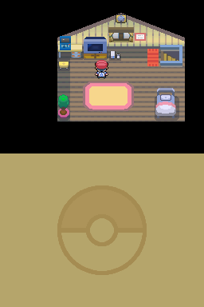
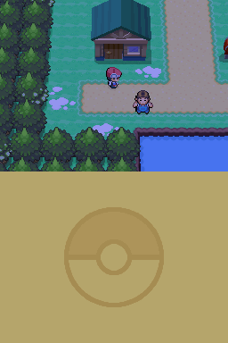
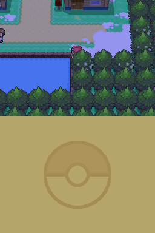

# nds

[](https://github.com/x0cero/nds/actions/workflows/ci.yml)

Nintendo DS emulator written from scratch in Rust. Runs Pokémon Platinum from boot into 3D overworld gameplay, including loading a real save file.

Sibling project to my [Game Boy](https://github.com/x0cero/gameboy) and [Game Boy Advance](https://github.com/x0cero/gba) emulators. Same rules: no emulation libraries and no ported reference code. Both ARM cores, the dual-engine 2D video, the 3D geometry engine and rasterizer, the cartridge interface, the touchscreen, and the inter-processor FIFO were each built against hardware documentation (GBATEK, mostly) and debugged one failing behavior at a time. No BIOS or firmware images are required; the BIOS calls games make are implemented in high-level Rust, and the firmware (user settings, Wi-Fi calibration, access-point blocks) is synthesized.

  

Screenshots are framebuffer dumps from this emulator (Pokémon Platinum is © Game Freak and Nintendo; no commercial ROMs are included or distributed).

## Status

The target game is Pokémon Platinum, chosen because it exercises almost everything the DS has: both CPUs, the 2D engines on both screens, the 3D engine for the overworld, the touchscreen, the real-time clock, save flash over AUXSPI, and even the Wi-Fi hardware (the game initializes the radio on every save load and refuses to continue if it is absent). What works today:

- Boots from a ROM through the full intro: touch-screen tutorial (stylus via mouse or scripted input), character naming, Professor Rowan's speech.
- Plays into the 3D overworld: the bedroom, Twinleaf Town, Lake Verity, with NPCs, dialog, and scripted events. Around 300 to 900 polygons per frame through the geometry engine and software rasterizer.
- Continue-from-save works with a real save file. This required emulating enough of the Wi-Fi baseband register interface for the game's radio self-test to pass, which was one of the more surprising debugging journeys in the project.
- Save files persist to `<rom>.sav`, and full-machine savestates make any scene reachable in about a tenth of a second instead of a multi-minute replay.
- The ARMv5TE core passes the armwrestler test suite; the ARMv4 core is the same one that runs Pokémon FireRed frame-identical to mGBA in the GBA project.

Not done yet, in rough priority order: audio (none at all), compressed 4x4 textures (DS terrain uses them heavily; they render flat gray), toon/highlight shading and shadow volumes, affine and bitmap backgrounds, per-scanline effects (everything latches once per frame), and the real-time clock protocol (Platinum currently thinks it is always night, which is why the outdoor screenshots are moody).

## How it was debugged

The methodology carried over from the GBA project: when the game misbehaves, compare against ground truth instead of guessing. melonDS and DeSmuME (scripted through py-desmume) served as reference emulators, with probe scripts in `tools/` that set exec hooks, watch register writes, and dump memory at checkpoints on the reference side for diffing against this emulator's own extensive logging (`NDS_IOLOG`, `NDS_TRACE`, `NDS_VIDLOG`, `NDS_GXLOG`, `NDS_POLYSTATS`, and about a dozen more, all documented in the source).

Some bugs would not fall to differential testing and needed archaeology instead: dumping all 4 MB of main RAM, disassembling the game's own code, and tracing from a visible symptom down through the game's logic to the hardware register it was actually stuck on. The Wi-Fi discovery above came from noticing the ARM7 had hammered the wireless registers 12,947 times.

## Building and running

```sh
cargo build --release
./target/release/nds path/to/rom.nds
```

No commercial ROMs are included in this repository, and none ever will be. `tests/armwrestler.nds` is the freely distributed [armwrestler-fixed](https://github.com/Atem2069/armwrestler-fixed) CPU test ROM, which CI runs on every push.

Saves are written to `<rom>.sav` next to the ROM. Savestates: F5 saves, F9 loads, and the number keys select the slot.

## Controls

| DS | Keyboard |
|----|----------|
| A / B | X / Z |
| X / Y | S / A |
| Start / Select | Enter / Right Shift |
| D-pad | Arrow keys |
| L / R | Q / W |
| Touch screen | Mouse (click and drag on the lower screen) |

Headless scripted runs are also supported for testing: `NDS_FRAMES` runs a fixed number of frames and dumps the final framebuffer, `NDS_INPUT` scripts button presses by frame range, and `NDS_TOUCH` scripts stylus input the same way.

## Architecture

- `src/cpu.rs`: one ARM core generic over the bus, with a flag gating the ARMv5TE extensions (BLX, CLZ, the QADD and SMULxy families, LDRD/STRD, CP15 with DTCM relocation). The same core runs as the ARM9 and the ARM7.
- `src/bus.rs`: the shared machine. Main RAM, shared WRAM banking, the VRAM bank mapper, IPC sync and FIFO, cartridge interface with KEY1 secure-area decryption, DMA, timers, RTC, SPI (firmware flash, touchscreen controller, save chip), the Wi-Fi register block, and per-CPU interrupt state.
- `src/ppu.rs`: both 2D engines. Text backgrounds, sprites (regular and affine, OBJ window), extended palettes, windows, blending, master brightness, display capture.
- `src/gpu3d.rs`: the geometry engine. Command FIFO, matrix stacks in 20.12 fixed point, lighting, the full vertex command set, double-buffered polygon RAM.
- `src/render3d.rs`: the software rasterizer. Sutherland-Hodgman clipping, perspective-correct half-space rasterization, W/Z buffering, texture sampling for six formats, two-pass translucency.
- `src/state.rs`: full-machine savestates via serde.
- `src/key1.rs`: the Blowfish variant used for secure-area decryption.
- `src/main.rs`: the minifb frontend, the direct-boot loader, the scheduler, and the scripted-input test harness.
- `tools/`: py-desmume probe scripts used as differential-testing ground truth.

## License

MIT. See [LICENSE](LICENSE).
